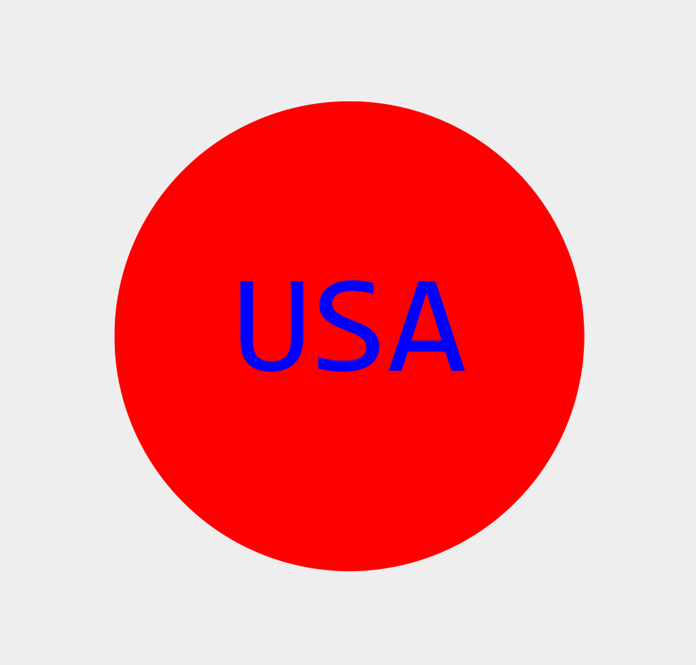

# svg-logo-creator-
An SGV two dimensional logo maker, using Jest and Inquirer  

# User
AS a  web developer
I WANT to generate a simple logo for my projects

# Criteria 
GIVEN a command-line application that accepts user input
WHEN I am prompted for text
THEN I can enter up to three characters
WHEN I am prompted for the text color
THEN I can enter a color keyword (OR a hexadecimal number)
WHEN I am prompted for a shape
THEN I am presented with a list of shapes to choose from: circle, triangle, and square
WHEN I am prompted for the shape's color
THEN I can enter a color keyword (OR a hexadecimal number)
WHEN I have entered input for all the prompts
THEN an SVG file is created 
AND the output text "Generated logo.svg" is printed in the command line
WHEN I open the `logo.svg` file in a browser
THEN I am shown a 300x200 pixel image that matches the criteria I entered
Mock-Up

# Notes
Referenced this video while working on the logos - https://www.youtube.com/watch?v=zh9CsKqEhOM
I also seeked help a few times from ask BCS, Tom and Anthony. Mostly syntax errors to matching as well as svg duplicating. Overal pretty fun project. 

# Walkthrough Video 
https://youtu.be/d5vi8sqVNaI

# GitHub
https://github.com/Hannahphoto/svg-logo-creator-

# Screenshot 

    
    

